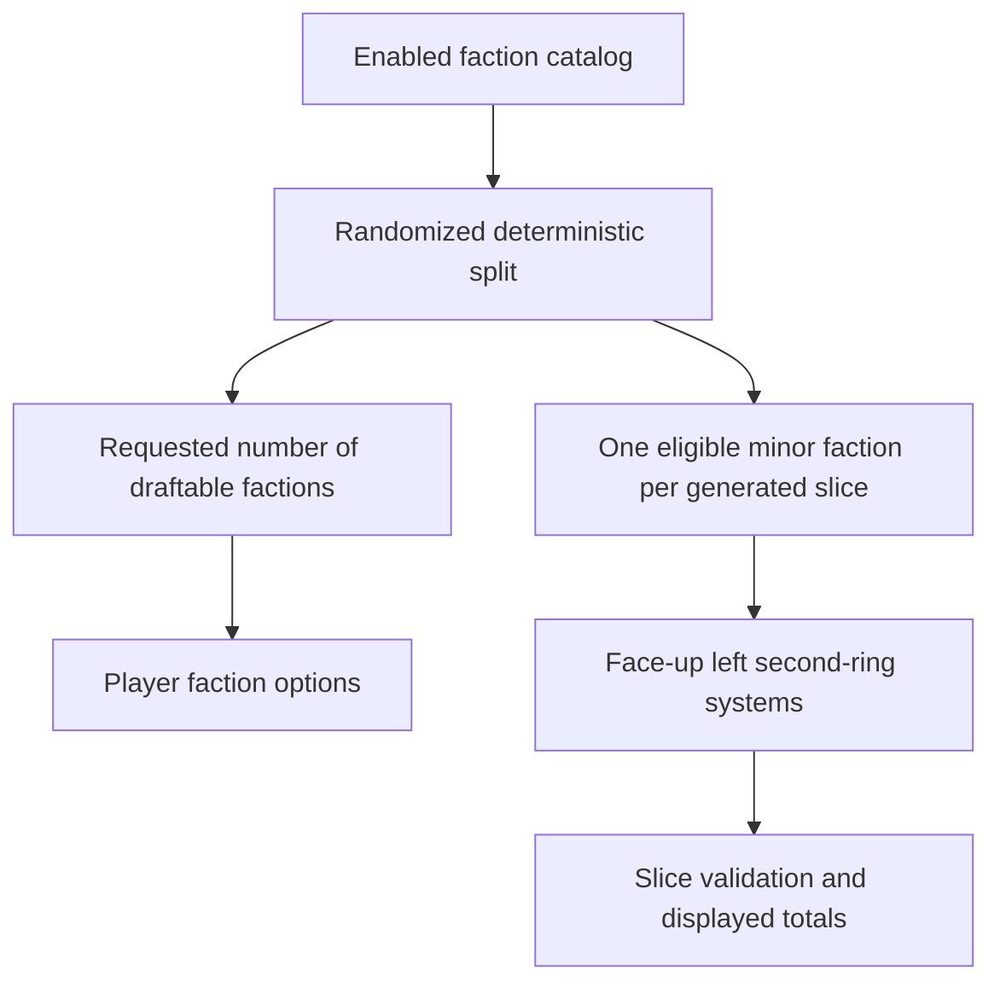

# Minor Factions Generation Split Requirements

## Context

The current implementation incorrectly treats Minor Factions as leftovers from player picks. That delays their identity until the draft is nearly complete, hides their home systems during slice selection, and excludes their printed values from slice balance.

Minor Factions shall instead be determined when the draft is generated. The enabled faction catalog is split into a requested draftable pool and a disjoint minor pool. Every generated slice receives one face-up eligible minor home system before players make any picks.

## Requirements

### R1: Split the enabled faction catalog during generation
**Priority:** Must
**Description:** Draft generation shall allocate exactly the requested number of factions to the draftable pool and one eligible Minor Faction to every generated slice from factions not allocated as draftable.
**Acceptance Criteria:**
- [ ] When Minor Factions is enabled: the draftable pool contains exactly the requested number of factions.
- [ ] When Minor Factions is enabled: every generated slice has exactly one Minor Faction.
- [ ] When pools are compared: no faction appears in both the draftable and minor pools.
- [ ] When enabled faction sources cannot supply both pools: generation fails before persistence with a specific actionable error.

### R2: Preserve selection boundaries and determinism
**Priority:** Must
**Description:** Both pools shall use only the enabled faction sets. Existing custom-pinned factions belong to the draftable pool, and the same seed and settings shall reproduce the same split and slice pairing.
**Acceptance Criteria:**
- [ ] When custom factions are pinned: each remains draftable and is never allocated as a Minor Faction.
- [ ] When disabled faction sets contain eligible factions: none are used to supplement either pool.
- [ ] When identical settings and seed are generated twice: draftable order, minor order, and slice pairing are identical.

### R3: Present Minor Factions face up before drafting
**Priority:** Must
**Description:** Each generated slice shall display its assigned Minor Faction home system face up at the left-side second-ring location before any faction, slice, or position pick occurs.
**Acceptance Criteria:**
- [ ] When a new draft page opens before the first pick: every slice displays a named Minor Faction home system at axial coordinate `(-1, 0)`.
- [ ] When extra unchosen slices exist: they also display their own Minor Factions.
- [ ] When the draft is reloaded: the same face-up systems remain paired with the same slices.

### R4: Treat the minor home system as part of its slice
**Priority:** Must
**Description:** The minor home system replaces one dealt blue system and participates in the slice's resources, influence, optimal values, wormholes, legendary limits, and other slice rules using its printed tile data.
**Acceptance Criteria:**
- [ ] When slice totals are displayed: they include the assigned minor home system's printed resources and influence.
- [ ] When slice constraints are evaluated: the assigned minor home system participates exactly like the system it replaces.
- [ ] When maps, individual slices, tile lists, and TTS strings are generated: every surface uses the persisted minor home-system ID at the left-side second-ring coordinate.
- [ ] When Minor Factions is disabled: existing five-system slice behavior is unchanged.

### R5: Restore ordinary slice defaults and faction-count behavior
**Priority:** Must
**Description:** Because the face-up minor home system restores five valued systems, Minor Factions shall use the ordinary slice constraint defaults. The requested faction count shall describe only the draftable pool and shall not be raised to twice the player count.
**Acceptance Criteria:**
- [ ] When Minor Factions is enabled: the form retains the ordinary `4 / 2.5 / 9-13` slice defaults.
- [ ] When player count or mode changes: the faction minimum remains one draftable faction per player.
- [ ] When a default Minor Factions form is submitted: generation succeeds without editing advanced settings for supported configurations.

### R6: Persist generated Minor Factions as authoritative slice state
**Priority:** Must
**Description:** Minor assignments shall be persisted at draft creation because they affect slice identity and balance; they shall not be recomputed from player picks, reloads, undo, or polling.
**Acceptance Criteria:**
- [ ] When a generated draft is saved and reloaded: minor identities, home systems, and slice pairings are unchanged.
- [ ] When player picks are made or undone: minor identities and slice totals do not change.
- [ ] When a mode-enabled saved draft is loaded: every slice must contain its persisted assignment; malformed or missing assignment state fails explicitly.

## Non-Requirements

- Automating neutral infantry placement, alliance-card ownership, planet-trait markers, or gameplay after setup.
- Changing the existing flexible three-category snake draft order.
- Allocating Minor Factions from faction sets that were not enabled for the draft.
- Allowing custom-pinned draftable factions to be reused as Minor Factions.
- Supporting pre-correction Minor Factions drafts; none exist.

## Key Decisions

- “Available but unselected” means enabled factions not selected into the generated draftable pool, not draftable factions left unpicked by players.
- Allocate one Minor Faction per generated slice, including extra slice options, so every slice is fully valued before selection.
- Persist the randomized split because it is generation output and affects published slice balance.
- Persisted Minor Factions state is strict: a mode-enabled draft without one valid assignment per slice is malformed.

## Success Criteria

- A creator can generate a standard supported Minor Factions draft with untouched defaults.
- Before the first pick, every slice shows a distinct eligible Minor Faction at the official left-side second-ring coordinate.
- Displayed totals and every map/export surface use the same persisted home system.
- Draftable and minor faction names are disjoint and reproducible from the seed.
