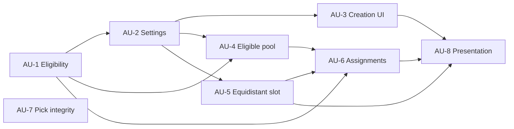

# Plan: Minor Factions Variant

## Context Summary

The application already persists the exact randomized faction pool used by a draft, records player faction and position picks, renders a resolved map from speaker positions and slice tile indices, and supports backward-compatible optional settings. Minor Factions can therefore be added without a second mutable assignment store: after the required picks resolve, assignments can be derived from the persisted faction pool by removing selected playable factions and explicitly ineligible factions, preserving the seeded pool order, and pairing the remaining candidates to speaker positions.

The equidistant map location is slice tile index `4` in the current slice geometry and all supported 3–8 player map templates. Minor Factions mode shall reserve that location for a minor home system and remove its original blue system from the resolved map. Eligibility must be explicit because some factions do not resolve to an ordinary planetary home system: Ghosts of Creuss has a non-planet gateway tile, Council Keleres has no single home-system tile, and Crimson Rebellion and Ghoti Wayfarers have recorded home tiles with no planets. No institutional learnings exist under `docs/solutions/` or fallback memory locations.

## Requirements Trace

| Requirement | Source | Atomic Unit(s) |
|-------------|--------|-----------------|
| R1: A creator can enable or disable Minor Factions mode when creating a draft. | Direct request | AU-2, AU-3 |
| R2: Minor candidates come only from the exact persisted faction pool that was available in that draft. | Direct request | AU-4, AU-6 |
| R3: Player-selected factions are excluded from minor candidates. | Direct request | AU-6 |
| R4: Factions that cannot serve as minor factions are explicitly marked and skipped. | Direct request | AU-1, AU-4, AU-6 |
| R5: One eligible minor faction is assigned per player to the equidistant slot in speaker order. | Official Minor Factions rules; direct request | AU-5, AU-6, AU-8 |
| R6: Minor Factions uses one fewer blue system per player by reserving slice tile index `4`. | Official Minor Factions rules | AU-5, AU-8 |
| R7: Assignment selection is deterministic across reload, regeneration, undo, and recompletion. | Existing seeded draft behavior | AU-4, AU-6 |
| R8: Draft creation fails before play when the generated pool cannot guarantee enough eligible unselected factions. | Derived safety requirement | AU-2, AU-4 |
| R9: Public API draft data, configuration, resolved maps, individual slices, tile lists, and TTS strings expose the mode and assignments without persisting derived snapshots. | Existing application surfaces | AU-2, AU-6, AU-8 |
| R10: Existing saved drafts and mode-disabled drafts retain their current behavior and payload compatibility. | Existing persistence contract | AU-2, AU-5, AU-6, AU-8 |
| R11: A crafted faction pick outside the persisted faction pool cannot corrupt minor-faction selection. | Derived integrity requirement | AU-7 |

## User Stories

### US-1: Configure a Minor Factions draft

```gherkin
Feature: Minor Factions configuration
  As a draft creator
  I want to enable Minor Factions when creating a draft
  So that the generated draft reserves one equidistant minor home system per player

  Scenario: Create a valid Minor Factions draft
    Given Minor Factions is enabled
    And the requested faction pool can contain two eligible factions per player
    When the draft is generated
    Then the setting is saved and returned by the draft API
    And each slice reserves its equidistant blue slot for a minor faction

  Scenario: Reject an undersized eligible pool
    Given Minor Factions is enabled
    And the requested faction pool cannot leave one eligible faction per player after all players choose factions
    When the creator submits the form
    Then draft creation fails with a specific validation message
```

Acceptance: R1, R6, R8, R9

### US-2: Select minor factions from draft leftovers

```gherkin
Feature: Minor faction selection
  As a player
  I want minor factions selected from eligible factions I could have drafted but nobody selected
  So that unavailable or already-played factions never appear as minor factions

  Scenario: Resolve minor assignments
    Given the persisted draft pool contains eligible and ineligible factions
    And every player has selected a faction and a speaker position
    When minor assignments are resolved
    Then selected player factions are excluded
    And factions outside the persisted draft pool are excluded
    And ineligible factions are excluded
    And the first eligible leftovers in persisted pool order are paired to speaker positions

  Scenario: Hide unresolved assignments
    Given one or more faction or position picks are incomplete
    When draft data is returned
    Then no minor assignments are exposed
```

Acceptance: R2, R3, R4, R5, R7

### US-3: View and export the resolved map

```gherkin
Feature: Minor faction map output
  As a completed-draft participant
  I want the resolved map and exports to include the assigned minor systems
  So that the generated setup can be used at the table or in Tabletop Simulator

  Scenario: Render a completed Minor Factions map
    Given a completed Minor Factions draft
    When the map is rendered
    Then each speaker position's slice tile index 4 shows its assigned minor home system
    And the full map, individual slices, tile list, and TTS string use the same home-system IDs

  Scenario: Render a standard draft
    Given Minor Factions is disabled
    When the map is rendered
    Then every slice and export retains its existing tile layout
```

Acceptance: R5, R6, R9, R10

### US-4: Preserve the candidate invariant

```gherkin
Feature: Faction-pick integrity
  As a draft participant
  I want the server to accept only faction options from the persisted draft pool
  So that minor assignments cannot be manipulated by submitting an unavailable faction

  Scenario: Reject an out-of-pool faction pick
    Given it is a player's turn to choose a faction
    When the player submits a faction name absent from the persisted faction pool
    Then the request is rejected
    And the draft state remains unchanged
```

Acceptance: R2, R11

## Scope Boundaries

### In Scope

- A Minor Factions toggle on draft creation and read-only configuration display on the draft page.
- An explicit per-faction eligibility attribute covering official and supported homebrew factions.
- An eligibility rule in data: a faction is eligible when its `homesystem` resolves to a standard placeable tile in `data/tiles.json` with at least one planet; Ghosts of Creuss, Council Keleres, Crimson Rebellion, and Ghoti Wayfarers are ineligible under the current catalog.
- Validation and faction-pool construction that guarantee at least one eligible leftover per player even if every player selects an eligible faction.
- Candidate derivation strictly from the persisted draft faction pool, never from all factions or merely enabled editions.
- Deterministic assignment in persisted faction-pool order to player speaker positions.
- Reservation and replacement of equidistant slice tile index `4`.
- Public API exposure and browser map/export presentation, while derived assignment snapshots remain absent from persisted draft files.
- Server-side faction-pick membership validation.
- Backward-compatible loading of saved drafts created before the setting existed.

### Out of Scope

- A generalized Galactic Events framework or support for other Thunder's Edge events.
- Tracking neutral infantry, all-trait planet status, control of minor systems, or transfer of alliance cards during gameplay.
- Automating physical component setup instructions beyond showing the assigned faction and home-system tile.
- Adding special placement behavior for nonstandard factions marked ineligible by the planetary-home-system rule.
- Changing the three-round slice/faction/position draft sequence.

## Atomic Units

### AU-1: Model minor-faction eligibility
- [x] **Goal:** Every faction declares whether it can supply a standard planetary minor home system.
**Requirements:** R4
**Dependencies:** None
**Files:**
- `data/factions.json` -- Add explicit minor-faction eligibility metadata to each faction record.
- `data/FactionDataTest.php` -- Require a boolean eligibility value and validate eligible home-system references.
- `app/TwilightImperium/Faction.php` -- Parse and expose eligibility as faction domain data.
- `app/TwilightImperium/FactionTest.php` -- Cover eligible and exceptional faction records.
**Approach:**
- Use explicit data rather than inferring eligibility at assignment time; special factions make inference unstable.
- Mark a faction eligible only when its recorded home system resolves to a placeable tile in `data/tiles.json` with at least one planet; alliance-reference content is not modeled or used as an eligibility input in this feature.
- Mark Ghosts of Creuss, Council Keleres, Crimson Rebellion, and Ghoti Wayfarers ineligible under the current catalog; keep Firmament/Obsidian eligible through its placeable `96a` home tile.
- Make missing eligibility metadata a data-test failure so new factions require an intentional decision.
**Test Scenarios:**
- When all faction records are loaded: every record supplies boolean eligibility metadata.
- When an eligible faction is loaded: its home-system ID resolves to a tile containing at least one planet.
- When Ghosts, Keleres, Crimson Rebellion, or Ghoti Wayfarers is loaded: the faction is reported ineligible.
- When Firmament/Obsidian is loaded: the faction is eligible and resolves to tile `96a`.
**Verification:**
- `docker compose exec app vendor/bin/phpunit data/FactionDataTest.php app/TwilightImperium/FactionTest.php` -- exits 0

### AU-2: Persist and validate the mode setting
- [x] **Goal:** Minor Factions configuration is represented in settings and remains backward compatible with existing draft JSON.
**Requirements:** R1, R8, R9, R10
**Dependencies:** AU-1
**Files:**
- `app/Draft/Settings.php` -- Add the mode flag, serialize it, default absent saved values to disabled, and validate the numeric lower bound.
- `app/Draft/SettingsTest.php` -- Cover serialization, restoration, disabled defaults, and minimum faction-count validation.
- `app/Testing/Factories/DraftSettingsFactory.php` -- Support explicit mode construction with a disabled default.
- `app/Draft/Exceptions/InvalidDraftSettingsException.php` -- Add a specific insufficient-minor-candidates error.
**Approach:**
- Persist a single boolean configuration flag; derive assignments instead of persisting them independently.
- Read absent JSON with `false` to preserve historical fixtures.
- IF the mode is enabled and `numberOfFactions < 2 × player count`: reject settings before generation.
- Leave pool-content validation to AU-4 because custom choices and ineligible factions are not knowable from the numeric setting alone.
**Test Scenarios:**
- When mode is enabled: settings round-trip with the flag enabled.
- When an old saved draft omits the flag: settings load with mode disabled.
- When six players request fewer than twelve faction options: validation fails with the Minor Factions-specific error.
- When mode is disabled: the existing faction-count rules remain unchanged.
**Verification:**
- `docker compose exec app vendor/bin/phpunit app/Draft/SettingsTest.php` -- exits 0

### AU-3: Add creation and configuration controls
- [x] **Goal:** Draft creators can enable Minor Factions and understand its faction-pool requirement.
**Requirements:** R1, R8, R9
**Dependencies:** AU-2
**Files:**
- `templates/generate.php` -- Add the variant toggle, official-rule explanation, and eligible-pool guidance.
- `app/Http/RequestHandlers/HandleViewFormRequestTest.php` -- Assert rendered toggle and eligibility guidance content.
- `js/minor-factions.js` -- Provide dependency-free pure helpers for browser constraints and later map substitution.
- `js/main.js` -- Enable dependent help/validation state and raise the client-side faction minimum when the mode is active.
- `tests/js/minor-factions.test.cjs` -- Exercise mode-dependent numeric constraints through Node's built-in test runner.
- `app/Http/RequestHandlers/HandleGenerateDraftRequest.php` -- Parse the mode flag into settings.
- `app/Http/RequestHandlers/HandleGenerateDraftRequestTest.php` -- Cover enabled and omitted request values and invalid submissions.
**Approach:**
- Follow the existing Alliance Mode request/settings pattern without coupling the two variants.
- Treat browser constraints as guidance only; server validation remains authoritative.
- Put calculation logic in a browser/CommonJS-compatible pure helper so Node can verify it without adding a package manager or DOM library.
- Display that exceptional factions may remain playable but do not count toward the required eligible reserve.
**Test Scenarios:**
- When the form posts the enabled flag: the request handler creates settings with Minor Factions enabled.
- When the form omits the flag: the request handler creates settings with Minor Factions disabled.
- When the displayed player count changes under the enabled mode: the faction-option minimum updates to twice the player count.
- When an invalid enabled request reaches the server: the response is HTTP 400 with the specific validation error.
- When the creation form is rendered: it contains the toggle, official-rule guidance, and the playable-but-ineligible warning.
**Verification:**
- `docker compose exec app vendor/bin/phpunit app/Http/RequestHandlers/HandleGenerateDraftRequestTest.php` -- exits 0
- `docker compose exec app vendor/bin/phpunit app/Http/RequestHandlers/HandleViewFormRequestTest.php` -- exits 0
- `node --test tests/js/minor-factions.test.cjs` -- exits 0

### AU-4: Guarantee an eligible reserve in the persisted faction pool
- [x] **Goal:** Every generated Minor Factions draft pool can leave one eligible minor faction per player under the worst valid player selections.
**Requirements:** R2, R4, R7, R8
**Dependencies:** AU-1, AU-2
**Files:**
- `app/Draft/Commands/GenerateFactionPool.php` -- Preserve custom choices while constructing and validating the eligible reserve from enabled faction sources.
- `app/Draft/Commands/GenerateFactionPoolTest.php` -- Cover eligible reserves, pinned ineligible factions, shortages, seed stability, and ordinary-mode behavior.
- `app/Draft/Exceptions/InvalidDraftSettingsException.php` -- Reuse the Minor Factions-specific pool-content failure.
**Approach:**
- Build the final pool only from the same enabled sets and custom faction rules used today.
- Preserve explicitly requested custom factions, including playable-but-minor-ineligible factions.
- Prioritize enough eligible factions in the remaining slots to reach `2 × player count` eligible entries; fill any remaining slots with the existing randomized candidates.
- IF the requested pool size or enabled sources cannot contain that eligible reserve after preserving custom choices: fail draft generation before saving.
- Preserve persisted pool order as the deterministic future assignment order; do not add another random draw during assignment.
- Never supplement the final pool from factions outside enabled sets.
**Test Scenarios:**
- When a six-player mode-enabled pool is generated: it contains at least twelve eligible factions.
- When a custom ineligible faction is pinned and enough slots remain: it remains playable and the pool also contains twelve eligible factions.
- When pinned choices or enabled sets make the reserve impossible: generation fails before draft persistence.
- When the same seed and settings are used: faction order and eligible reserve are identical.
- When mode is disabled: existing custom and seeded pool behavior is unchanged.
**Verification:**
- `docker compose exec app vendor/bin/phpunit app/Draft/Commands/GenerateFactionPoolTest.php` -- exits 0

### AU-5: Reserve the equidistant blue slot
- [x] **Goal:** Minor Factions slices resolve with one fewer blue system and a reserved equidistant slot at tile index `4`.
**Requirements:** R5, R6, R10
**Dependencies:** AU-2
**Files:**
- `app/Draft/Commands/GenerateSlicePool.php` -- Arrange mode-enabled slices so tile index `4` is a replaceable blue system.
- `app/Draft/Commands/GenerateSlicePoolTest.php` -- Cover reserved-slot color, determinism, custom-slice behavior, and mode-off parity.
- `app/Draft/Slice.php` -- Expose the equidistant index and effective tile/value behavior without changing stored historical slices.
- `app/Draft/SliceTest.php` -- Cover equidistant-slot and effective-slice calculations.
**Approach:**
- Define the equidistant index in the slice domain and expose it through the public mode payload so browser code does not duplicate the literal.
- For generated mode-enabled slices, ensure index `4` contains a blue tile that is omitted from the resolved map.
- Keep the stored five-tile slice shape for persistence compatibility; treat index `4` as reserved in mode-enabled output.
- Apply minimum/maximum resource, influence, total, wormhole, and legendary constraints to the four retained systems; the discarded index `4` tile cannot satisfy any constraint.
- Exclude the reserved blue tile from mode-enabled effective slice totals shown for draft evaluation because it will not exist in the final map.
- IF custom slices are supplied with the mode: require their index `4` tile to be blue so replacement has official one-fewer-blue semantics.
**Test Scenarios:**
- When a mode-enabled generated slice is produced: index `4` is blue and excluded from effective totals.
- When a reserved blue tile contains a wormhole, legendary planet, resources, or influence: none of those values satisfy effective-slice generation constraints.
- When the same seed is reused: slice IDs and reserved indices remain identical.
- When a mode-enabled custom slice has a red or nonstandard index `4`: validation fails.
- When mode is disabled: stored tiles, totals, and arrangement behavior remain unchanged.
**Verification:**
- `docker compose exec app vendor/bin/phpunit app/Draft/Commands/GenerateSlicePoolTest.php app/Draft/SliceTest.php` -- exits 0

### AU-6: Derive deterministic minor assignments
- [x] **Goal:** Completed drafts expose one deterministic eligible leftover faction per speaker position without storing duplicate state.
**Requirements:** R2, R3, R4, R5, R7, R9, R10
**Dependencies:** AU-1, AU-4, AU-5
**Files:**
- `app/Draft/MinorFactionAssignments.php` -- Derive pending, resolved, or invalid assignment results from pool order, player picks, eligibility, and speaker positions.
- `app/Draft/MinorFactionAssignmentsTest.php` -- Cover selection, exclusion, ordering, incomplete picks, excess candidates, and shortages.
- `app/Draft/Draft.php` -- Separate persisted source data from public derived output and expose mode status, equidistant index, and assignments only in public arrays.
- `app/Draft/DraftTest.php` -- Cover payload shape, reload stability, undo disappearance, and recompletion stability.
**Approach:**
- Candidate flow: persisted `factionPool` -> remove every player-picked faction -> remove ineligible factions -> take player count in persisted order.
- Assignment flow: candidates -> players sorted by numeric speaker position -> assignment records containing position, faction name, and home-system tile ID.
- Return a `pending` public resolution with an empty assignment list until every player has both a faction and speaker position.
- Return an `invalid` public resolution with code `insufficient_eligible_candidates` and no partial assignments if a malformed mode-enabled draft has fewer candidates than players; do not throw during save, GET, pick, undo, or regeneration.
- Return a `resolved` public resolution with exactly one assignment per player when all requirements are met.
- Derive on every public serialization so reload, undo, and recompletion cannot leave stale assignments.
- Keep derived status and assignments out of `toFileContent()`; persisted files contain only the setting, faction pool, slices, players, and picks that are their source of truth.
- Expose `equidistant_index` from the server in the public mode payload so JavaScript does not duplicate the PHP slice constant.
**Test Scenarios:**
- When all picks are complete: exactly one eligible minor is assigned to each speaker position.
- When a faction was in the pool but selected by a player: it is absent from assignments.
- When a faction is eligible but outside the persisted pool: it is absent from assignments.
- When an ineligible faction remains unselected: it is skipped.
- When more eligible leftovers exist than players: the first candidates in persisted pool order are used.
- When a faction or position pick is undone: assignments disappear until the draft is resolvable again.
- When a draft is serialized and reloaded: assignments remain identical.
- When a draft is saved: its file contains the enabled setting but no derived assignment snapshot.
- When a malformed enabled draft has too few candidates: public output reports the defined invalid code and no partial assignments without breaking persistence or request flows.
**Verification:**
- `docker compose exec app vendor/bin/phpunit app/Draft/MinorFactionAssignmentsTest.php app/Draft/DraftTest.php` -- exits 0

### AU-7: Enforce faction-pick membership
- [x] **Goal:** The server rejects faction selections that were not present in the draft's persisted faction pool.
**Requirements:** R2, R11
**Dependencies:** None
**Files:**
- `app/Draft/Commands/PlayerPick.php` -- Validate faction-category options against the draft faction pool before mutation.
- `app/Draft/Commands/PlayerPickTest.php` -- Cover accepted in-pool and rejected out-of-pool choices with unchanged state.
- `app/Draft/Exceptions/InvalidPickException.php` -- Add a precise unavailable-faction error.
- `app/Http/RequestHandlers/HandlePickRequestTest.php` -- Assert the request-level error response and status.
**Approach:**
- Apply membership validation only to faction picks; slice and position checks retain their current paths unless existing validation already covers them.
- Validate before updating player data or appending the log.
- Return the existing invalid-pick HTTP error contract with a precise message.
**Test Scenarios:**
- When a player submits a faction present in the pool: the pick succeeds.
- When a player submits a faction absent from the pool: the pick fails and players, log, and current turn are unchanged.
- When a non-faction pick is submitted: existing behavior is unchanged.
**Verification:**
- `docker compose exec app vendor/bin/phpunit app/Draft/Commands/PlayerPickTest.php app/Http/RequestHandlers/HandlePickRequestTest.php` -- exits 0

### AU-8: Present assignments and replace map tiles
- [x] **Goal:** Draft pages and all map exports consistently show assigned minor home systems in the equidistant slots.
**Requirements:** R5, R6, R9, R10
**Dependencies:** AU-3, AU-5, AU-6
**Files:**
- `templates/draft.php` -- Show mode configuration, assignment table, setup guidance, and equidistant placeholders before resolution.
- `app/Http/RequestHandlers/HandleViewDraftRequestTest.php` -- Assert rendered resolved, pending, invalid, and disabled presentation states.
- `js/minor-factions.js` -- Resolve server-described equidistant substitutions and export tokens through pure testable helpers.
- `js/generate-map.js` -- Replace slice index `4` with the assignment home-system ID in full maps, individual slices, tile lists, and TTS strings.
- `js/draft.js` -- Refresh assignment presentation and invalidate cached maps when picks, undo, or polling changes resolution.
- `tests/js/minor-factions.test.cjs` -- Verify substitution, unresolved placeholders, coordinate preservation, tile-gather output, and TTS token behavior.
- `tests/js/minor-factions-integration.test.cjs` -- Execute the shipped map/draft scripts through `node:vm` with a minimal DOM/jQuery fixture.
- `css/style.scss` -- Style minor placeholders and assignment output.
- `css/style.css` -- Keep the shipped stylesheet synchronized with the SCSS source.
**Approach:**
- Consume only server-derived assignment records; do not recompute eligibility or candidates in JavaScript.
- Keep DOM-independent calculation and substitution behavior in the pure helper, then verify the shipped script wiring separately.
- Consume the server-provided `equidistant_index`; do not duplicate the literal `4` in browser assignment logic.
- Centralize substitution through the pure helper used by `lookup()` so every existing map/export consumer receives the same tile.
- Before assignments resolve, display a neutral Minor Faction placeholder and emit `0` at every reserved TTS coordinate; preserve TTS token count and coordinate ordering while excluding the discarded blue tile.
- After assignments resolve, label each system with the faction name and home-system tile ID.
- For an `invalid` server resolution, display the server-provided configuration error, keep reserved positions as `0`, and never fabricate or partially substitute assignments.
- Use a dependency-free `node:vm` integration fixture for fast shipped-script coverage, plus a development-only Playwright test for the real UI/server completion and undo paths required by the final integration gate.
- IF mode is disabled: bypass all new substitution and presentation paths.
**Test Scenarios:**
- When a completed 3–8 player Minor Factions draft is rendered: each position receives its assignment at tile index `4`.
- When full-map and individual-slice views are compared: they use identical minor home-system IDs.
- When tile gather and TTS output are generated: they include minor home systems and exclude reserved blue tiles.
- When assignments are unresolved: placeholders appear, TTS reserved coordinates contain `0`, token count is unchanged, and no stale faction assignment is shown.
- When assignment resolution is invalid: the error is visible and exports preserve empty reserved coordinates without partial assignments.
- When a final pick, undo, or remote poll changes assignment readiness: the map cache is invalidated and output refreshes.
- When the real map script receives resolved and pending fixture payloads: it calls the shared helper for full-map and individual-slice lookups and produces the expected substitution.
- When the real draft script observes final-pick, undo, or poll readiness transitions: it clears the existing map cache before regeneration.
- When the draft page is rendered for resolved, pending, invalid, and disabled fixtures: the expected assignment table, placeholder, error, or unchanged standard markup is present.
- When mode is disabled or an old draft is loaded: map HTML and export strings follow the existing path.
**Verification:**
- `docker compose exec app composer phpunit` -- exits 0
- `docker compose exec app composer phpstan` -- exits 0
- `docker compose exec app composer cs:check` -- exits 0
- `node --test tests/js/minor-factions.test.cjs` -- exits 0
- `node --test tests/js/minor-factions-integration.test.cjs` -- exits 0
- `npm run test:e2e` -- exits 0 against the running local application

## Dependency Graph



AU-7 is independently committable but must ship before the feature is considered complete.

## Key Technical Decisions

- **Persist configuration, derive public assignments:** The mode flag is stored, while assignment status and records are recomputed only for public output and omitted from saved JSON. This avoids stale snapshots across undo, reload, and regeneration.
- **Use the persisted faction pool as the sole candidate source:** Enabled editions describe possible inputs but do not prove a faction appeared in the actual draft. This directly enforces the requested exclusion.
- **Preserve pool order instead of reseeding:** The pool is already seeded, randomized, and persisted. Filtering it produces stable assignments and avoids the regeneration seed mismatch in current settings.
- **Require an eligible worst-case reserve:** At least `2 × player count` eligible entries ensures players can choose any eligible factions and still leave one eligible minor per player.
- **Model eligibility explicitly from a settled rule:** A supported faction is eligible only when its recorded home-system ID resolves to a placeable tile with at least one planet. Edition and tile tier alone are insufficient.
- **Publish the reserved index:** The slice domain owns index `4` and public output exposes it; JavaScript consumes that field rather than maintaining a second constant.
- **Keep five stored tile IDs:** Existing JSON remains readable and structurally stable; mode-aware behavior treats the reserved blue tile as discarded in effective output.

## Open Questions

### Resolved During Planning

- Which factions may become minors: only eligible, unselected factions from the persisted draft pool; never factions merely present in an enabled edition.
- How assignments are randomized: preserve the already-seeded persisted faction-pool order and take the first eligible leftovers.
- How assignments map to the board: pair candidates to numeric speaker positions and substitute slice tile index `4`.
- When assignments appear: only after every faction and speaker-position pick is present.
- How many faction options are required: the final pool must contain at least two eligible factions per player.
- Initial exceptional-faction handling: Ghosts of Creuss, Council Keleres, Crimson Rebellion, and Ghoti Wayfarers are ineligible; Firmament/Obsidian is eligible through tile `96a`.
- Saved-versus-public representation: saved JSON omits derived assignment status and records; public JSON includes `enabled`, `equidistant_index`, `status`, `assignments`, and an error code only when invalid.
- Invalid malformed-draft behavior: return an invalid public resolution without throwing or returning partial assignments.
- Unresolved TTS representation: emit `0` at reserved coordinates so geometry and token counts remain stable.

### Deferred to Implementation

- Confirm whether the current generated CSS workflow requires a local Sass command or a targeted synchronized edit; no build system is documented. [AU-8, R9]

## Unchanged Invariants

- Mode-disabled faction generation, faction order for existing seeds, slice generation, map rendering, and exports must not change.
- Existing saved drafts without the new setting must load successfully and serialize with Minor Factions disabled.
- The saved `factions` array remains the authoritative exact draft pool and retains its existing public shape.
- The saved `slices` array retains five tile IDs per slice for backward compatibility.
- Player draft sequencing, Alliance Mode behavior, regeneration permissions, undo authorization, and secret handling remain unchanged.
- Public draft payloads continue excluding secrets.
- Regeneration before the first pick remains supported and produces assignments from the regenerated persisted pool, not the original settings seed.

## Risk Register

| Risk | Likelihood | Impact | Mitigation |
|------|-----------|--------|------------|
| Eligibility metadata is wrong for a special or homebrew faction. | Medium | High | Apply the single planetary-home-system rule to every record, require explicit data, and fail data tests when an eligible record does not resolve to a planetary tile. |
| A custom-faction request leaves insufficient room for the eligible reserve. | Medium | Medium | Preserve custom choices but reject impossible pool sizes before saving with an actionable error. |
| Equidistant replacement changes slice valuation after players evaluated options. | Medium | High | Reserve index `4` from creation, mark it as a placeholder, and exclude its discarded blue tile from effective totals. |
| JavaScript map output diverges between full map, slice map, and TTS string. | Medium | High | Perform substitution in the shared `lookup()` seam and exercise all outputs in acceptance checks. |
| Global RNG use makes a new shuffle disturb historical seeds. | Medium | High | Add no assignment shuffle; filter persisted pool order and assert mode-disabled seed fixtures remain unchanged. |
| Older draft fixtures break when new settings or payload fields are introduced. | Medium | High | Default absent settings to disabled and cover every historical fixture through the full suite. |
| Mode-enabled custom slices reserve a non-blue tile. | Low | Medium | Validate custom slice index `4` during settings/slice validation and return a specific error. |

## Sources & References

- `app/Draft/Commands/GenerateFactionPool.php` -- Existing enabled-set, custom-selection, seed, and final pool behavior.
- `app/Draft/Draft.php` -- Authoritative persisted pool, player state, serialization, and completion behavior.
- `app/Draft/Settings.php` -- Existing optional-setting and backward-compatible JSON patterns.
- `app/Draft/Slice.php` -- Equidistant tile geometry and slice arrangement rules.
- `js/generate-map.js` -- Shared full-map, slice-map, tile-gather, and TTS lookup seam.
- `data/factions.json` and `data/tiles.json` -- Faction/home-system mappings and special cases.
- `templates/generate.php` and `js/main.js` -- Alliance Mode configuration pattern to follow.
- [Fantasy Flight Games, Twilight Codex Volume IV: Liberation](https://images-cdn.fantasyflightgames.com/filer_public/f6/be/f6be8343-a4fc-47e4-a722-efe3e01fc5d9/ti_codex_4_rules.pdf) -- Official Minor Factions setup behavior.
- Direct user request -- Candidate pool must be limited to eligible factions that were available in the draft but remained unselected.
