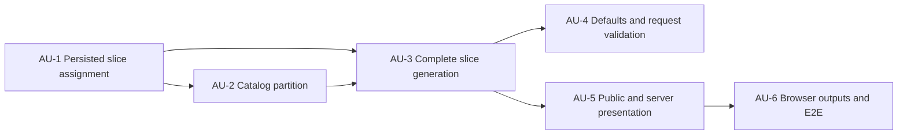

# Plan: Correct Minor Factions Generation Split

## Context Summary

The existing implementation interprets Minor Factions as eligible factions left after player picks. It therefore overfills the draftable faction pool, hides a blue system until the draft resolves, excludes the eventual home system from slice balance, and assigns minors by speaker position instead of by slice.

The corrected model treats Minor Factions as immutable generation output. The enabled faction catalog is deterministically partitioned into exactly the requested draftable pool and one disjoint eligible minor per generated slice. Each minor's canonical home tile is persisted directly on its slice at index `3`, the left second-ring coordinate `(-1, 0)`. Generated Minor Factions slices physically contain two blue systems, two red systems, and that green home system; all five tiles participate in validation and presentation.

The faction partition and slices form one invariant and shall be staged before a single save. In Minor Factions mode, regenerating either factions or slices regenerates both atomically. There are no historical Minor Factions drafts, so mode-enabled persisted data is strict and must contain a valid assignment on every slice.

## Requirements Trace

| Requirement | Atomic Unit(s) |
|---|---|
| R1: Split enabled factions into an exact draftable pool and one disjoint eligible minor per slice. | AU-2, AU-3 |
| R2: Respect enabled sets and pinned factions; reproduce the split and pairing from the seed. | AU-2, AU-3 |
| R3: Show named minor homes face up at index `3` / axial `(-1, 0)` before any pick. | AU-1, AU-5, AU-6 |
| R4: Count the minor home in all slice values, constraints, maps, and exports. | AU-3, AU-4, AU-5, AU-6 |
| R5: Restore ordinary slice defaults and one-draftable-faction-per-player minimum. | AU-4 |
| R6: Persist assignments as authoritative slice state and reject incomplete or malformed mode-enabled state. | AU-1, AU-3, AU-5 |

## User Stories

### US-1: Generate a fully valued draft

```gherkin
Feature: Generation-time Minor Faction split
  As a draft creator
  I want the enabled factions partitioned before slices are published
  So that each faction option and each face-up minor is known before drafting begins

  Scenario: Generate a valid draft
    Given Minor Factions is enabled
    And the enabled catalog can supply the requested draftable factions and one eligible minor per slice
    When the draft is generated
    Then the draftable pool has exactly the requested size
    And every slice has one distinct eligible minor outside that pool
    And identical settings and seed reproduce the same pools and pairings

  Scenario: Reject an impossible partition
    Given the enabled catalog cannot supply both pools
    When generation is requested
    Then an actionable validation error is returned
    And no draft is persisted
```

### US-2: Evaluate complete slices before picks

```gherkin
Feature: Face-up valued minor homes
  As a player
  I want each slice's minor home visible and counted immediately
  So that I can compare the actual slices I am drafting

  Scenario: Open a new draft
    Given a corrected Minor Factions draft with no picks
    When the draft page opens
    Then every slice shows its named minor home at axial coordinate (-1, 0)
    And the displayed totals and constraints include that home tile
    And picks, undo, polling, and reload do not change the pairing
```

### US-3: Regenerate without breaking the invariant

```gherkin
Feature: Atomic Minor Factions regeneration
  As a draft administrator
  I want faction or slice regeneration to rebuild their shared invariant
  So that draftable factions never overlap the homes already assigned to slices

  Scenario: Regenerate factions or slices
    Given a Minor Factions draft has no picks
    When either faction or slice regeneration is requested
    Then both pools are regenerated and validated as one staged result
    And the result is saved once only after all validation succeeds

  Scenario: Regeneration fails
    Given regeneration cannot construct a valid partition and slice pool
    When regeneration is requested
    Then the original saved draft remains unchanged
    And an actionable validation error is returned
```

## Scope Boundaries

### In Scope

- Exact deterministic partition of the enabled faction catalog.
- Pinned custom factions retained exclusively in the draftable pool.
- Explicit rejection of unknown, disabled, duplicate, or excessive pinned factions.
- One persisted eligible faction name and canonical logical home-tile ID per slice.
- Separate presentation/export token derived from faction domain data for Discordant Stars compatibility.
- Generated composition of two blue systems, two red systems, and one green minor home per slice.
- Five-tile validation, totals, map, individual-slice, tile-list, and TTS behavior.
- Coupled atomic faction/slice regeneration.
- Actionable HTTP 400 responses for generation and regeneration domain failures.

### Out of Scope

- Neutral infantry, alliance-card ownership, planet-trait markers, or gameplay automation.
- A generalized Galactic Events framework.
- A new four-ID custom-slice input format; existing five-ID rows retain index `3` as the replacement slot.
- Broad repository concurrency or compare-and-swap support.
- Changing the three-category snake draft.
- Compatibility or migration logic for pre-correction Minor Factions drafts; none exist.

## Architecture Decisions

1. **Persist the fact, not a late projection.** `Slice` owns an optional `MinorFaction` assignment containing faction name and canonical tile ID. Its absence is valid only when Minor Factions is disabled.
2. **Fail closed on incomplete state.** Every mode-enabled saved draft must have exactly one valid assignment per slice. Missing, malformed, duplicate, mismatched, or overlapping state is rejected; no migration discriminator is needed.
3. **Generate one aggregate.** `GenerateFactionPool` always returns a `FactionPartition`, including a draftable-only partition with an empty minor list when the mode is disabled. A generation coordinator returns draftable factions and fully composed slices together. No repository write occurs until catalog partitioning, arrangement, and final slice validation all succeed.
4. **Keep one visible five-tile representation.** Corrected slices store the green home at index `3`; totals and every output surface consume `Slice::tiles` directly. No hidden blue or client-side substitution remains for corrected drafts.
5. **Couple regeneration.** In Minor Factions mode, selecting either faction or slice regeneration rebuilds both. Player-order-only regeneration leaves both unchanged.
6. **Preserve custom input semantics.** A five-ID custom slice uses index `3` as the replaceable blue slot. Generation replaces it with the assigned home and validates the resulting five-tile slice.
7. **Require matching custom cardinality.** In Minor Factions mode, the number of custom rows must equal `numberOfSlices`; this same count sizes the minor pool and prevents unmatched assignments.
8. **Publish explicit identifier fields.** Each corrected slice exposes `minor_faction.name`, `minor_faction.tile_id`, and `minor_faction.render_token`. PHP reconstruction and valuation use `tile_id`; artwork, tile gather, and TTS use `render_token` without a browser-side faction catalog lookup.

## Dependency Graph



## Atomic Units

### AU-1: Model persisted per-slice Minor Faction state

- [x] **Goal:** Mode-enabled drafts save and reload an authoritative valid minor assignment on every slice and reject incomplete state.
**Requirements:** R3, R6
**Dependencies:** None
**Files:**
- `app/Draft/MinorFaction.php` — Add an immutable value object for faction name, canonical home tile ID, validation, and serialization.
- `app/Draft/Slice.php` — Accept an optional assignment for mode-disabled compatibility and keep index `3` as the semantic equidistant constant.
- `app/Draft/Draft.php` — Persist and reconstruct assignments, reject missing/malformed mode-enabled state, and stop deriving assignments from player picks.
- `app/Draft/MinorFactionTest.php` — Cover domain validation and DS canonical/render identifiers.
- `app/Draft/SliceTest.php` — Cover assigned, disabled, malformed, index `3`, and coordinate semantics.
- `app/Draft/DraftTest.php` — Cover round-trip, required mode-enabled state, pick/undo stability, and fail-closed malformed state.
**Approach:**
- Persist faction name and `Faction::homeSystemTileNumber` as canonical source data. Derive `Faction::homesystem()` only for browser/export presentation.
- For corrected state, require one assignment per slice, unique minor faction names, canonical tile/faction agreement, and no missing catalog references.
- Remove `MinorFactionAssignments` and its pick-derived public/persistence path.
**Test Scenarios:**
- Corrected state round-trips with the same faction, tile, order, pairing, and totals.
- A Discordant Stars home persists by logical tile ID and exposes the expected rendering token.
- Picks, undo, poll serialization, and reload do not affect assignments.
- A mode-enabled file missing any assignment is rejected explicitly.
- A marked corrected file with a duplicate, missing, mismatched, or unknown assignment fails explicitly.
**Verification:**
- `docker compose exec -T app vendor/bin/phpunit app/Draft/MinorFactionTest.php app/Draft/SliceTest.php app/Draft/DraftTest.php`

### AU-2: Deterministically partition the enabled faction catalog

- [x] **Goal:** Generation returns exactly the requested draftable factions and the required disjoint eligible minor factions from enabled sources.
**Requirements:** R1, R2
**Dependencies:** AU-1
**Files:**
- `app/Draft/FactionPartition.php` — Add a typed result holding ordered draftable and minor faction lists and enforcing disjointness.
- `app/Draft/FactionPartitionTest.php` — Cover result invariants for enabled and disabled modes.
- `app/Draft/Commands/GenerateFactionPool.php` — Replace the `2 × players` reserve behavior with one deterministic partition sized by `numberOfFactions` and `numberOfSlices`.
- `app/Draft/Commands/GenerateFactionPoolTest.php` — Rewrite mode tests for exact sizes, eligibility, pins, enabled boundaries, shortages, Keleres, and seed stability.
- `app/Draft/Exceptions/InvalidDraftSettingsException.php` — Provide actionable catalog-capacity and invalid-pin failures.
**Approach:**
- Gather the enabled catalog once, with the Council Keleres toggle authoritative.
- Validate pins before random selection: every name must be known, unique, enabled, and fit within the requested draftable count.
- Reject unless `pinCount <= numberOfFactions`, `enabledCatalogCount >= numberOfFactions + numberOfSlices`, and `eligibleNonPinnedCount >= numberOfSlices`.
- Place all pins in the draftable pool. Using one existing `Seed::setForFactions()` phase, shuffle the eligible non-pinned candidates, reserve the first `numberOfSlices` as minors, remove them, shuffle the remaining enabled catalog, fill the unpinned draftable slots, then deterministically shuffle the final draftable and minor arrays.
- Return `FactionPartition` in both modes; mode-disabled generation returns the existing draftable selection and an empty minor list.
- Preserve deterministic ordered results without adding a new seed phase or supplementing disabled sets.
**Test Scenarios:**
- Draftable count equals the request and minor count equals slice count for player counts 3–8 and extra slices.
- Pools are unique and disjoint; every minor is eligible; ineligible factions may remain draftable.
- Pinned factions remain draftable and never become minors.
- Disabled sets, disabled Keleres, and unknown factions cannot enter either pool.
- Duplicate, disabled, unknown, or excessive pins fail before generation.
- Identical settings and seed reproduce both ordered lists; capacity shortage returns the exact domain error.
**Verification:**
- `docker compose exec -T app vendor/bin/phpunit app/Draft/Commands/GenerateFactionPoolTest.php app/Draft/FactionPartitionTest.php`

### AU-3: Generate and regenerate complete valued slices atomically

- [x] **Goal:** Every corrected slice is generated and validated as two blue systems, two red systems, and its assigned green home, with faction/slice state saved only as a complete invariant.
**Requirements:** R1, R2, R4, R6
**Dependencies:** AU-1, AU-2
**Files:**
- `app/Draft/Commands/GenerateSlicePool.php` — Accept ordered minor assignments, draw two blue/two red systems per generated slice, replace custom index `3`, arrange, and validate final tiles.
- `app/Draft/TilePool.php` — Add a Minor-mode selection path that draws two blue-tier IDs and two red IDs per slice without assuming one high, one medium, and one low blue.
- `app/Draft/Commands/GenerateSlicePoolTest.php` — Cover composition, capacity, custom replacement, final-value constraints, pool-wide constraints, arrangement, and determinism.
- `app/Draft/Commands/GenerateDraft.php` — Coordinate partition first, generate paired slices, and construct corrected persisted state only after all checks pass.
- `app/Draft/Commands/GenerateDraftTest.php` — Assert end-to-end invariants and no repository save on failure.
- `app/Draft/Commands/RegenerateDraft.php` — Stage coupled faction/slice replacement in Minor mode and mutate/save the draft only after success.
- `app/Draft/Commands/RegenerateDraftTest.php` — Cover coupling, order-only independence, stable failure state, and no partial save.
**Approach:**
- Pair minor factions to slice order deterministically before arranging the ordinary systems.
- In generated mode, combine high/mid/low IDs into one blue candidate list, deterministically shuffle that combined list using the slice seed, draw exactly `2 × slices` unique blue IDs and `2 × slices` red IDs, distribute two of each per slice, insert each green home at index `3`, arrange, and validate all five visible tiles. Mode-disabled tier selection remains unchanged. Tests shall prove the draw is not biased toward the concatenated high tier.
- Update tile capacity validation to `min(floor(blue / 2), floor(red / 2))` only in Minor mode. The historical five-slice base-game hard cap remains only for ordinary three-blue mode; Minor mode uses the calculated two-blue/two-red capacity.
- Evaluate per-slice resources, influence, optimal totals, alpha/beta, legendary, anomaly adjacency, and pool-wide minimums against the final tile arrays.
- For custom slices, require five IDs and a blue replacement tile at index `3`; replace it, then validate the complete final slice.
- In Minor mode, reject custom input unless its row count exactly equals `numberOfSlices` before partitioning.
- In Minor mode, any faction-or-slice regeneration request stages a new partition and slice pool together; order-only never changes them.
- Stage the new `Settings` containing the regeneration seed, player order/current player, faction partition, and slices in local values. Commit all requested mutations to the draft only after generation succeeds, then save once. A failure with order regeneration selected leaves both the object and repository unchanged.
**Test Scenarios:**
- Each slice has exactly two blue, two red, and one assigned green home at index `3` / axial `(-1, 0)`.
- The home tile can satisfy or violate every applicable slice and pool-wide rule using its printed data.
- No unused hidden blue is serialized or included in capacity calculations.
- Boundary tile sets succeed up to the two-blue/two-red Minor-mode capacity and fail immediately above it.
- Same seed reproduces draftable order, minor order, slice IDs, and pairings.
- A failed initial generation creates no saved draft; failed regeneration leaves the original object and saved file byte-equivalent.
- Slice-only and faction-only regeneration both rebuild the coupled state; order-only preserves it.
- Successful regeneration persists its new seed, and that seed reproduces the regenerated partition and slice graph; failed regeneration does not change order, current player, settings, pools, or saved bytes.
**Verification:**
- `docker compose exec -T app vendor/bin/phpunit app/Draft/Commands/GenerateSlicePoolTest.php app/Draft/Commands/GenerateDraftTest.php app/Draft/Commands/RegenerateDraftTest.php`

### AU-4: Restore ordinary defaults and authoritative request validation

- [x] **Goal:** Minor Factions uses normal five-system constraints and the requested faction count means only draftable choices.
**Requirements:** R4, R5
**Dependencies:** AU-3
**Files:**
- `app/Draft/Settings.php` — Remove the `2 × players` Minor Factions faction-count rule and retain the ordinary one-per-player boundary.
- `app/Draft/SettingsTest.php` — Replace obsolete reserve tests with corrected numeric boundaries and ordinary defaults.
- `js/minor-factions.js` — Remove four-system presets and return normal faction/default constraints.
- `js/main.js` — Preserve user-edited settings across toggles while no longer applying Minor-specific values or minimums.
- `tests/js/minor-factions.test.cjs` — Cover untouched defaults, player-count changes, mode toggles, and custom-value preservation.
- `templates/generate.php` — Replace incorrect reserve/help text with the generation-time split rule and required eligible count per slice.
- `app/Http/RequestHandlers/HandleGenerateDraftRequest.php` — Validate and dispatch the same parsed settings instance, and convert partition/slice domain failures into actionable HTTP 400 responses.
- `app/Http/RequestHandlers/HandleGenerateDraftRequestTest.php` — Cover exact request meaning, default success, and no-dispatch/no-save failures.
- `app/Http/RequestHandlers/HandleRegenerateDraftRequest.php` — Return actionable failures for staged coupled regeneration.
- `app/Http/RequestHandlers/HandleRegenerateDraftRequestTest.php` — Cover coupled options and HTTP failure behavior.
**Approach:**
- Keep default values `4 / 2.5 / 9–13` regardless of the toggle.
- Keep the HTML/client/server faction minimum equal to player count.
- Validate Minor-mode custom row count equals `numberOfSlices` and calculate Minor-mode tile capacity from two blue and two red systems per slice.
- State that the requested faction count is the draftable pool and the catalog must additionally provide one eligible unused faction per generated slice.
- Catch domain generation errors around dispatch without converting unexpected exceptions into validation responses.
- Parse settings once so an omitted seed is generated once, validated once, dispatched unchanged, and persisted unchanged.
**Test Scenarios:**
- Enabling Minor Factions never changes untouched or customized slice values.
- Changing player count keeps the faction minimum at one per player.
- A default supported request succeeds without advanced edits.
- Impossible catalogs and malformed pins receive the specific 400 response and persist nothing.
- Domain exceptions from generation and regeneration return 400 with zero saves; unexpected exceptions still propagate.
- Regeneration UI/request semantics reflect coupled faction/slice generation.
**Verification:**
- `docker compose exec -T app vendor/bin/phpunit app/Draft/SettingsTest.php app/Http/RequestHandlers/HandleGenerateDraftRequestTest.php app/Http/RequestHandlers/HandleRegenerateDraftRequestTest.php app/Http/RequestHandlers/HandleViewFormRequestTest.php`
- `node --test tests/js/minor-factions.test.cjs`

### AU-5: Publish face-up per-slice state from the server

- [x] **Goal:** The draft page and public payload expose complete Minor Faction slices before the first pick from the persisted slice representation.
**Requirements:** R3, R4, R6
**Dependencies:** AU-3
**Files:**
- `app/Draft/Draft.php` — Publish per-slice faction name, canonical tile ID, render token, and totals without pick-dependent states.
- `templates/draft.php` — Render the actual home tile and visible faction name on every mode-enabled slice before picks.
- `app/Http/RequestHandlers/HandleViewDraftRequestTest.php` — Cover first-render, extra slices, reload, accessible names, malformed state, and mode-off parity.
- `app/Draft/MinorFactionAssignments.php` — Remove the obsolete pick-derived assignment service after callers are migrated.
- `app/Draft/MinorFactionAssignmentsTest.php` — Remove obsolete behavior tests with the implementation.
- `js/draft.js` — Remove pick-triggered pending/resolved rebuilding and render only authoritative per-slice state from poll responses.
- `tests/js/minor-factions-integration.test.cjs` — Replace pick-dependent cache/assignment tests with authoritative per-slice poll, reload, and undo stability tests.
**Approach:**
- Make the slice payload the single authoritative input for server and browser views, with exact `minor_faction: {name, tile_id, render_token}` fields.
- Include visible text and accessible/title text naming the minor faction, not only tile artwork.
**Test Scenarios:**
- Before the first pick, every generated and extra slice contains a named face-up home at the semantic coordinate.
- Displayed resources/influence and special properties include that home.
- Reload, picks, undo, and polling preserve byte-equivalent assignment payloads.
- Disabled drafts render safely without minor metadata; malformed enabled drafts fail before rendering.
- Polling and undo never synthesize or clear corrected per-slice state in `js/draft.js`.
**Verification:**
- `docker compose exec -T app vendor/bin/phpunit app/Draft/DraftTest.php app/Http/RequestHandlers/HandleViewDraftRequestTest.php`

### AU-6: Use persisted slice tiles across maps and exports

- [x] **Goal:** Full maps, individual slices, tile gathers, and TTS strings use the same persisted home tile already present in each selected slice.
**Requirements:** R3, R4
**Dependencies:** AU-5
**Files:**
- `js/generate-map.js` — Remove speaker-position substitution and consume the chosen slice's actual tile IDs/render tokens directly.
- `js/minor-factions.js` — Retain only shared semantic-coordinate/presentation helpers still needed; remove pending/resolved assignment logic.
- `tests/js/minor-factions.test.cjs` — Cover direct per-slice resolution, DS tokens, strict malformed-state behavior, and index-to-coordinate mapping.
- `tests/js/minor-factions-integration.test.cjs` — Cover all map/export consumers using the same authoritative corrected payload.
- `tests/e2e/minor-factions.spec.cjs` — Verify a fresh untouched-default draft before picks, totals, extra slices, selection by slice, final map, individual slices, tile list, TTS string, reload, undo, and regeneration.
**Approach:**
- Resolve the home by the picked slice, never by speaker position or the player's faction pick.
- Keep canonical logical tile IDs for PHP lookup/valuation and use faction-derived render/export tokens at asset/TTS boundaries.
- Ensure any browser cache is invalidated from the authoritative draft payload, though picks should not change assignments.
**Test Scenarios:**
- Reversing player object order or speaker positions cannot change a slice's minor.
- Every map/export surface includes the home at axial `(-1, 0)` and excludes the replaced blue ID.
- Discordant Stars homes load the correct image and TTS token while server totals use the canonical tile.
- Fresh 3–8 player supported drafts generate successfully with untouched defaults.
- Malformed enabled payloads are rejected rather than repaired or assigned in the browser.
**Verification:**
- `node --test tests/js/minor-factions.test.cjs`
- `npm run test:e2e -- tests/e2e/minor-factions.spec.cjs`
- `docker compose exec -T app vendor/bin/phpunit`

## Cross-Cutting Acceptance Criteria

- [x] Exact requested draftable count and exact one-minor-per-slice count are enforced.
- [x] Draftable and minor pools are unique, disjoint, eligible where required, and confined to enabled sources.
- [x] The home at index `3` / axial `(-1, 0)` is face up before picks and counted in every validation/summary.
- [x] Identical settings and seed reproduce draftable order, minor order, ordinary tile order, and slice pairing.
- [x] Generation and regeneration failures persist no partial state.
- [x] Mode-enabled persisted drafts require complete valid assignments and are never repaired by randomization.
- [x] Mode-disabled behavior and the existing snake draft remain unchanged.

## Risks and Mitigations

| Risk | Mitigation |
|---|---|
| Seed changes make results non-reproducible across the coordinated generators. | Reuse the existing faction and slice seed phases deliberately, persist the regenerated seed, and assert the complete generated graph twice in tests. |
| DS home identifiers work in PHP but fail in assets/TTS, or vice versa. | Persist canonical logical tile ID and derive a separate faction render token; test a DS faction end to end. |
| Regeneration mutates half the draft before a later failure. | Build local replacement values first, validate them, then mutate and save once. |
| Incomplete persisted state reaches the browser. | Validate every mode-enabled assignment during PHP reconstruction and fail before rendering or public serialization. |
| Custom slices retain a hidden fifth system. | Define index `3` as a declared replacement input, replace it before constructing the persisted `Slice`, and test serialization. |
| Client and server totals diverge. | Publish server-computed slice totals and make every surface consume the persisted final tile list. |

## Final Verification

1. `docker compose exec -T app vendor/bin/phpunit`
2. `node --test tests/js/minor-factions.test.cjs`
3. `node --test tests/js/minor-factions-integration.test.cjs`
4. `npm run test:e2e -- tests/e2e/minor-factions.spec.cjs`
5. Generate a fresh supported Minor Factions draft at `http://localhost:8080` with untouched defaults and verify every slice before the first pick.
6. Reload, complete picks, undo a pick, and confirm assignments/totals remain unchanged.
7. Trigger faction-only and slice-only regeneration on an unstarted draft and verify each produces a new valid coupled state.
